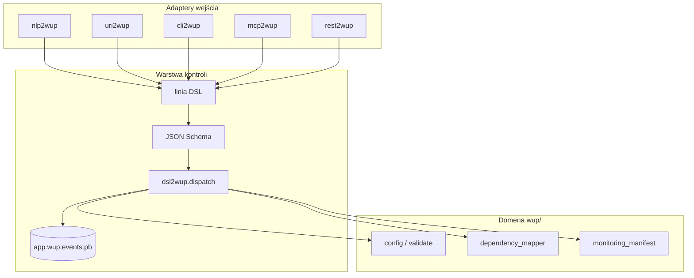

# WUP tooling packages (`*2wup`)

Warstwy **sterowania WUP** — MCP, DSL shell, URI i NL.

Powrót: [README główne wup](../README.md)

## Pakiety

| Pakiet | Rola | Port / entry |
|--------|------|----------------|
| **dsl2wup** | DSL sterowania WUP (QUERY, VALIDATE, MAP, PATCH, …) | `dsl2wup` |
| **uri2wup** | `wup://` URI — query, patch, resolve | `uri2wup` |
| **nlp2wup** | NL → DSL → dispatch | `nlp2wup` |
| **cli2wup** | Shell CLI (REPL) na bazie DSL | `cli2wup` |
| **mcp2wup** | Serwer MCP (stdio) | `mcp2wup serve` |
| **rest2wup** | REST API (FastAPI) | `rest2wup serve --port 8216` |

## Logika w `wup/` (core)

| Funkcja | Lokalizacja |
|---------|-------------|
| File watcher | `wup/core.py`, `wup/testql_watcher.py` |
| Config load/save | `wup/config.py` |
| Dependency map | `wup/dependency_mapper.py` |
| Monitoring manifest | `wup/monitoring_manifest.py` |
| CLI scan (adopt) | `wup/cli_scanner.py` |
| Health CQRS | `wup/testing/handlers/health_handlers.py` |

## Przepływ



## Verby DSL (lifecycle WUP)

| Query | Command |
|-------|---------|
| `QUERY`, `VALIDATE`, `HEALTH`, `STATUS`, `RESOLVE` | `MAP`, `INIT`, `PATCH`, `GENERATE`, `SYNC`, `ADOPT`, `INIT_CLI`, `ENDPOINTS` |

Przykłady:

```text
QUERY wup://block/project?file=wup.yaml FORMAT json
VALIDATE wup.yaml PROJECT .
HEALTH PROJECT .
MAP . OUT deps.json FRAMEWORK auto
INIT . OUT wup.yaml
PATCH wup://block/services WITH services.fragment.yaml FILE wup.yaml
GENERATE "fastapi project" OUT wup.yaml
SYNC . FILE wup.yaml
SYNC . FILE wup.yaml MERGE
ENDPOINTS scenarios/tests OUT testql-deps.json
INIT_CLI . OUT wup.yaml SCENARIOS testql-scenarios MERGE
ADOPT . OUT app.doql.less
```

## Instalacja (dev)

```bash
bash packages/install-dev.sh
```

## uri2wup decode (pełny profil)

```bash
uri2wup decode --uri 'wup://cmd/VALIDATE?path=wup.yaml&project=.'
uri2wup run --uri 'wup://cmd/QUERY?target=wup://block/project&file=wup.yaml'
```

## Shim `wup/control.py` + legacy CLI bridge

Legacy `wup` komendy delegują mutacje do busa:

| Komenda | Verb DSL |
|---------|----------|
| `wup init` | `INIT` |
| `wup map-deps` | `MAP` |
| `wup sync-testql --write` | `SYNC` |
| `wup sync-testql --write --merge-endpoints` | `SYNC … MERGE` |
| `wup assistant --quick` | `GENERATE` |
| `wup testql-endpoints` | `ENDPOINTS` |
| `wup init-cli` | `INIT_CLI` |
| `wup status --json` | `STATUS` |

```python
from wup.control import dispatch_validate, dispatch_command
from wup.cli_bridge import run_map_deps
dispatch_validate("wup.yaml", project=".")
```

`GENERATE` używa `wup/generate.py` (auto-detekcja z `WupAssistant`).

## Codegen (Faza 5)

```bash
python -m dsl2wup.codegen   # → dsl2wup/models.py  (wymaga pydantic)
dsl2wup validate-schema    # pełny audit: handler ⇒ schema ⇒ protobuf
```

## Testy

```bash
pytest packages/dsl2wup/tests packages/uri2wup/tests packages/nlp2wup/tests \
       packages/cli2wup/tests packages/mcp2wup/tests packages/rest2wup/tests tests/test_control.py -q
```
