# System Architecture Analysis

## Overview

- **Project**: /home/tom/github/semcod/wup
- **Primary Language**: python
- **Languages**: python: 24, yaml: 15, txt: 5, json: 2, shell: 1
- **Analysis Mode**: static
- **Total Functions**: 174
- **Total Classes**: 19
- **Modules**: 51
- **Entry Points**: 148

## Architecture by Module

### project.map.toon
- **Functions**: 50
- **File**: `map.toon.yaml`

### wup.core
- **Functions**: 24
- **Classes**: 2
- **File**: `core.py`

### wup.testql_watcher
- **Functions**: 18
- **Classes**: 2
- **File**: `testql_watcher.py`

### wup.dependency_mapper
- **Functions**: 16
- **Classes**: 1
- **File**: `dependency_mapper.py`

### wup.visual_diff
- **Functions**: 16
- **Classes**: 1
- **File**: `visual_diff.py`

### examples.visual_diff_demo
- **Functions**: 9
- **File**: `visual_diff_demo.py`

### wup.testql_discovery
- **Functions**: 7
- **Classes**: 1
- **File**: `testql_discovery.py`

### wup.cli
- **Functions**: 7
- **File**: `cli.py`

### wup.config
- **Functions**: 6
- **File**: `config.py`

### examples.testql_integration
- **Functions**: 6
- **Classes**: 1
- **File**: `testql_integration.py`

### examples.flask-app.app.auth.routes
- **Functions**: 5
- **File**: `routes.py`

### examples.fastapi-app.app.users.routes
- **Functions**: 5
- **Classes**: 1
- **File**: `routes.py`

### examples.multi-service.payments-service.app.payments.routes
- **Functions**: 3
- **File**: `routes.py`

### examples.multi-service.users-service.app.users.routes
- **Functions**: 3
- **File**: `routes.py`

### examples.testql_demo
- **Functions**: 2
- **File**: `testql_demo.py`

### examples.flask-app.main
- **Functions**: 2
- **File**: `main.py`

### examples.multi-service.payments-service.main
- **Functions**: 2
- **File**: `main.py`

### examples.multi-service.auth-service.main
- **Functions**: 2
- **File**: `main.py`

### examples.multi-service.auth-service.app.auth.routes
- **Functions**: 2
- **File**: `routes.py`

### examples.multi-service.users-service.main
- **Functions**: 2
- **File**: `main.py`

## Key Entry Points

Main execution flows into the system:

### wup.cli.status
> Show dependency map status and configuration.
- **Calls**: app.command, typer.Option, typer.Option, typer.Option, typer.Option, typer.Option, typer.Option, None.resolve

### wup.cli.watch
> Watch project for file changes and run intelligent regression tests.

Uses a 3-layer approach:
1. Detection: File watching with heuristics
2. Priority
- **Calls**: app.command, typer.Argument, typer.Option, typer.Option, typer.Option, typer.Option, typer.Option, typer.Option

### wup.cli.testql_endpoints
> Discover endpoints from TestQL scenario files and build dependency map.
- **Calls**: app.command, typer.Argument, typer.Option, typer.Option, Path, console.print, console.print, console.print

### examples.testql_integration.main
> Run WUP + TestQL integration demo.
- **Calls**: print, print, print, VisualDiffConfig, TestQLWatcher, print, watcher.dependency_mapper.build_from_codebase, watcher.dependency_mapper.save

### wup.cli.map_deps
> Build dependency map from codebase.
- **Calls**: app.command, typer.Argument, typer.Option, typer.Option, None.resolve, console.print, console.print, console.print

### wup.testql_watcher.TestQLWatcher.run_quick_test
- **Calls**: list, self._get_config_endpoints_for_service, self._select_scenarios_for_service, self.get_service_config, self.console.print, self._record_health_transition, self.console.print, self.console.print

### wup.testql_watcher.TestQLWatcher.run_detail_test
- **Calls**: list, self._get_config_endpoints_for_service, self._select_scenarios_for_service, self.console.print, len, len, self._run_testql, None.append

### wup.core.WupWatcher.__init__
> Initialize the WUP watcher.

Args:
    project_root: Path to the project root directory
    deps_file: Path to the dependency map JSON file
    cpu_th
- **Calls**: Path, DependencyMapper, set, deque, defaultdict, Console, None.exists, project.map.toon.load_config

### wup.dependency_mapper.DependencyMapper._scan_python_endpoints
> Scan Python files for endpoint definitions.
- **Calls**: self.project_root.rglob, py_file.read_text, str, py_file.relative_to, re.findall, endpoints.append, re.findall, None.split

### wup.testql_discovery.TestQLEndpointDiscovery.parse_scenario_endpoints
> Extract endpoints from a TestQL scenario file.

Args:
    scenario_path: Path to scenario file
    
Returns:
    List of endpoint paths found in the s
- **Calls**: list, re.compile, api_pattern.findall, set, open, f.read, endpoints.append, yaml.safe_load

### wup.cli.init
> Initialize a new wup.yaml configuration file.
- **Calls**: app.command, typer.Argument, typer.Option, None.resolve, Path, output_path.exists, project.map.toon.get_default_config, project.map.toon.save_config

### wup.core.WupWatcher.infer_service
> Infer service name from file path.

Uses config services first, then dependency mapper, then heuristics.
- **Calls**: self._to_relative_path, self.dependency_mapper.get_service_for_file, _re.match, len, None.is_file, None.join, None.lower, svc.name.lower

### wup.core.WupWatcher.start_watching
> Start watching for file changes.

Args:
    watch_paths: List of paths to watch (default: from config or common source directories)
- **Calls**: WupEventHandler, Observer, observer.start, self.console.print, observer.join, self.build_watched_paths, self.console.print, observer.schedule

### wup.core.WupWatcher.run_with_dashboard
> Run watcher with live dashboard.
- **Calls**: self.build_watched_paths, WupEventHandler, Observer, observer.start, observer.join, observer.schedule, Live, None.exists

### examples.visual_diff_demo.main
- **Calls**: print, print, print, examples.visual_diff_demo.demo_diff_algorithm, examples.visual_diff_demo.demo_page_slug, examples.visual_diff_demo.demo_snapshot_persistence, examples.visual_diff_demo.demo_config_yaml_round_trip, examples.visual_diff_demo.demo_disabled_is_noop

### wup.testql_watcher.TestQLWatcher._write_track
- **Calls**: int, None.replace, track_path.write_text, self.browser_notifier.notify, time.time, None.splitlines, None.splitlines, json.dumps

### wup.core.WupWatcher.create_status_table
> Create a status table for the dashboard.

Returns:
    Rich Table object with current status
- **Calls**: Table, table.add_column, table.add_column, table.add_column, table.add_column, sorted, self.last_test_times.get, self.dependency_mapper.get_endpoints_for_service

### examples.testql_integration.TestQLWatcher.run_detail_test
> Run detailed TestQL test with full coverage and blame reporting.
- **Calls**: self.console.print, self._find_scenarios_for_service, len, subprocess.run, self._generate_blame_report, self.console.print, self.console.print, self.console.print

### wup.visual_diff.VisualDiffer.get_recent_diffs
> Return all diff events newer than *seconds* ago.
- **Calls**: self.diff_dir.rglob, results.sort, int, self.diff_dir.exists, time.time, None.splitlines, json.loads, e.get

### examples.testql_integration.TestQLWatcher.run_quick_test
> Run quick smoke test using TestQL CLI.
Tests only 3 scenarios max for speed.
- **Calls**: self.console.print, self._find_scenarios_for_service, self.console.print, self.console.print, subprocess.run, asyncio.ensure_future, self.console.print, str

### wup.core.WupWatcher.on_file_change
> Handle file change event.

Args:
    file_path: Path to the changed file
- **Calls**: self._to_relative_path, any, self.infer_service, self.should_watch_file, self.should_test, self.changed_services.add, self.console.print, self.schedule_quick_test

### wup.dependency_mapper.DependencyMapper.build_from_testql_scenarios
> Build dependency map from TestQL scenario files.

Args:
    scenarios_dir: Path to TestQL scenarios directory
    testql_bin: TestQL executable name o
- **Calls**: TestQLEndpointDiscovery, discovery.to_dependency_map, None.items, None.items, self.to_dict, None.extend, None.update, None.extend

### wup.testql_discovery.TestQLEndpointDiscovery.discover_via_testql_cli
> Use TestQL CLI to discover endpoints.

Args:
    service: Optional service name to filter
    
Returns:
    List of discovered endpoints
- **Calls**: subprocess.run, str, cmd.extend, print, print, print, print, line.strip

### wup.dependency_mapper.DependencyMapper.build_from_codebase
> Build dependency map by scanning the codebase.

Args:
    framework: Framework to detect (auto, fastapi, flask, django, express)
    
Returns:
    Dic
- **Calls**: self._scan_endpoints, self.to_dict, self._detect_framework, ep.get, ep.get, self._infer_service, None.append, None.append

### wup.dependency_mapper.DependencyMapper._infer_service
> Infer service name from file path.

Examples:
    app/users/routes.py → "users"
    app/api/v1/devices.py → "api/v1/devices"
    src/components/auth.t
- **Calls**: Path, parts.index, parts.index, len, None.join, len, None.join, len

### wup.dependency_mapper.DependencyMapper.load
> Load the dependency map from a JSON file.
- **Calls**: None.items, defaultdict, open, json.load, info.get, set, data.get, data.get

### wup.testql_discovery.TestQLEndpointDiscovery.discover_all_endpoints
> Discover all endpoints from scenarios.

Returns:
    Dictionary mapping service names to endpoint info:
    {
        "service_name": {
            "e
- **Calls**: self.discover_scenarios, self.parse_scenario_endpoints, self.infer_service_from_scenario, None.update, None.append, set, sorted, list

### wup.core.WupWatcher.build_watched_paths
> Build list of paths to watch from config.

Returns:
    List of absolute paths to watch
- **Calls**: str, str, str, pattern.startswith, str, None.exists, pattern.replace, watch_paths.append

### wup.testql_watcher.TestQLWatcher.__init__
- **Calls**: None.__init__, self.track_dir.mkdir, BrowserNotifier, self.health_state_path.parent.mkdir, self._load_service_health, project.map.toon.load_config, VisualDiffer, Path

### wup.testql_watcher.TestQLWatcher._record_health_transition
- **Calls**: int, self.service_health.get, previous.get, self._save_service_health, self.browser_notifier.notify, time.time, self.health_events_path.open, handle.write

## Process Flows

Key execution flows identified:

### Flow 1: status
```
status [wup.cli]
```

### Flow 2: watch
```
watch [wup.cli]
```

### Flow 3: testql_endpoints
```
testql_endpoints [wup.cli]
```

### Flow 4: main
```
main [examples.testql_integration]
```

### Flow 5: map_deps
```
map_deps [wup.cli]
```

### Flow 6: run_quick_test
```
run_quick_test [wup.testql_watcher.TestQLWatcher]
```

### Flow 7: run_detail_test
```
run_detail_test [wup.testql_watcher.TestQLWatcher]
```

### Flow 8: __init__
```
__init__ [wup.core.WupWatcher]
```

### Flow 9: _scan_python_endpoints
```
_scan_python_endpoints [wup.dependency_mapper.DependencyMapper]
```

### Flow 10: parse_scenario_endpoints
```
parse_scenario_endpoints [wup.testql_discovery.TestQLEndpointDiscovery]
```

## Key Classes

### wup.core.WupWatcher
> Intelligent file watcher for regression testing.

Implements 3-layer testing:
1. Detection Layer: Fi
- **Methods**: 20
- **Key Methods**: wup.core.WupWatcher.__init__, wup.core.WupWatcher._to_relative_path, wup.core.WupWatcher.infer_service, wup.core.WupWatcher.detect_service_coincidences, wup.core.WupWatcher._services_share_domain, wup.core.WupWatcher.get_service_config, wup.core.WupWatcher.should_test, wup.core.WupWatcher.schedule_quick_test, wup.core.WupWatcher.schedule_detail_test, wup.core.WupWatcher.process_test_queue_once

### wup.dependency_mapper.DependencyMapper
> Maps project dependencies for intelligent testing.
- **Methods**: 16
- **Key Methods**: wup.dependency_mapper.DependencyMapper.__init__, wup.dependency_mapper.DependencyMapper.build_from_codebase, wup.dependency_mapper.DependencyMapper._detect_framework, wup.dependency_mapper.DependencyMapper._search_codebase, wup.dependency_mapper.DependencyMapper._scan_endpoints, wup.dependency_mapper.DependencyMapper._scan_python_endpoints, wup.dependency_mapper.DependencyMapper._scan_js_endpoints, wup.dependency_mapper.DependencyMapper._infer_service, wup.dependency_mapper.DependencyMapper.get_endpoints_for_file, wup.dependency_mapper.DependencyMapper.get_endpoints_for_service

### wup.testql_watcher.TestQLWatcher
> WUP watcher running selective TestQL scenarios for changed services.
- **Methods**: 16
- **Key Methods**: wup.testql_watcher.TestQLWatcher.__init__, wup.testql_watcher.TestQLWatcher._load_service_health, wup.testql_watcher.TestQLWatcher._save_service_health, wup.testql_watcher.TestQLWatcher._record_health_transition, wup.testql_watcher.TestQLWatcher._tokenize_service, wup.testql_watcher.TestQLWatcher._get_config_endpoints_for_service, wup.testql_watcher.TestQLWatcher._resolve_base_url, wup.testql_watcher.TestQLWatcher._to_full_url, wup.testql_watcher.TestQLWatcher._discover_scenarios, wup.testql_watcher.TestQLWatcher.get_service_config
- **Inherits**: WupWatcher

### wup.testql_discovery.TestQLEndpointDiscovery
> Discover endpoints from TestQL scenario files.
- **Methods**: 7
- **Key Methods**: wup.testql_discovery.TestQLEndpointDiscovery.__init__, wup.testql_discovery.TestQLEndpointDiscovery.discover_scenarios, wup.testql_discovery.TestQLEndpointDiscovery.parse_scenario_endpoints, wup.testql_discovery.TestQLEndpointDiscovery.infer_service_from_scenario, wup.testql_discovery.TestQLEndpointDiscovery.discover_all_endpoints, wup.testql_discovery.TestQLEndpointDiscovery.discover_via_testql_cli, wup.testql_discovery.TestQLEndpointDiscovery.to_dependency_map

### wup.visual_diff.VisualDiffer
> Triggered by TestQLWatcher after a file change.

Usage::

    differ = VisualDiffer(project_root, co
- **Methods**: 6
- **Key Methods**: wup.visual_diff.VisualDiffer.__init__, wup.visual_diff.VisualDiffer._pages_for_service, wup.visual_diff.VisualDiffer.run_for_service, wup.visual_diff.VisualDiffer._check_page, wup.visual_diff.VisualDiffer._write_diff_event, wup.visual_diff.VisualDiffer.get_recent_diffs

### examples.testql_integration.TestQLWatcher
> Custom WUP watcher integrated with TestQL test framework.

Overrides test methods to run actual Test
- **Methods**: 5
- **Key Methods**: examples.testql_integration.TestQLWatcher.__init__, examples.testql_integration.TestQLWatcher.run_quick_test, examples.testql_integration.TestQLWatcher.run_detail_test, examples.testql_integration.TestQLWatcher._find_scenarios_for_service, examples.testql_integration.TestQLWatcher._generate_blame_report
- **Inherits**: WupWatcher

### wup.core.WupEventHandler
> File system event handler for WUP watcher.
- **Methods**: 4
- **Key Methods**: wup.core.WupEventHandler.__init__, wup.core.WupEventHandler.on_modified, wup.core.WupEventHandler.on_created, wup.core.WupEventHandler.on_deleted
- **Inherits**: FileSystemEventHandler

### wup.testql_watcher.BrowserNotifier
> Send watcher events to browser-facing service and local file.
- **Methods**: 2
- **Key Methods**: wup.testql_watcher.BrowserNotifier.__init__, wup.testql_watcher.BrowserNotifier.notify

### examples.fastapi-app.app.users.routes.User
- **Methods**: 0
- **Inherits**: BaseModel

### wup.models.config.NotifyConfig
> Notification configuration for a service.
- **Methods**: 0

### wup.models.config.ServiceTestConfig
> Test configuration for a service (quick or detail).
- **Methods**: 0

### wup.models.config.ServiceConfig
> Configuration for a single service.
- **Methods**: 0

### wup.models.config.WatchConfig
> Configuration for file watching.
- **Methods**: 0

### wup.models.config.TestStrategyConfig
> Global test strategy configuration.
- **Methods**: 0

### wup.models.config.TestQLConfig
> TestQL-specific configuration.
- **Methods**: 0

### wup.models.config.VisualDiffConfig
> Configuration for visual DOM diff after file changes.
- **Methods**: 0

### wup.models.config.WebConfig
> Configuration for sending events to wup-web backend.
- **Methods**: 0

### wup.models.config.ProjectConfig
> Project metadata.
- **Methods**: 0

### wup.models.config.WupConfig
> Main WUP configuration.
- **Methods**: 0

## Data Transformation Functions

Key functions that process and transform data:

### wup.testql_discovery.TestQLEndpointDiscovery.parse_scenario_endpoints
> Extract endpoints from a TestQL scenario file.

Args:
    scenario_path: Path to scenario file
    

- **Output to**: list, re.compile, api_pattern.findall, set, open

### wup.core.WupWatcher.process_test_queue_once
- **Output to**: self.test_queue.popleft, self.console.print, self.cpu_ok, self.run_quick_test, self.schedule_detail_test

### project.map.toon.test_process_changed_file_creates_track_on_failure

### project.map.toon.validate_config

### wup.config.validate_config
> Validate raw config dict and convert to WupConfig object.

Args:
    raw: Raw configuration dictiona
- **Output to**: raw.get, ProjectConfig, raw.get, WatchConfig, raw.get

### wup.testql_watcher.TestQLWatcher.process_changed_file_once
- **Output to**: self.on_file_change, len, self.process_test_queue_once, asyncio.sleep, str

## Behavioral Patterns

### recursion__flatten
- **Type**: recursion
- **Confidence**: 0.90
- **Functions**: wup.visual_diff._flatten

## Public API Surface

Functions exposed as public API (no underscore prefix):

- `wup.cli.status` - 97 calls
- `wup.config.validate_config` - 82 calls
- `examples.testql_demo.simulate_testql_analysis` - 80 calls
- `wup.cli.watch` - 40 calls
- `wup.cli.testql_endpoints` - 40 calls
- `examples.testql_integration.main` - 27 calls
- `examples.visual_diff_demo.demo_snapshot_persistence` - 26 calls
- `wup.cli.map_deps` - 25 calls
- `wup.testql_watcher.TestQLWatcher.run_quick_test` - 23 calls
- `wup.testql_watcher.TestQLWatcher.run_detail_test` - 20 calls
- `wup.testql_discovery.TestQLEndpointDiscovery.parse_scenario_endpoints` - 16 calls
- `examples.visual_diff_demo.demo_diff_algorithm` - 16 calls
- `examples.visual_diff_demo.demo_config_yaml_round_trip` - 16 calls
- `wup.cli.init` - 16 calls
- `wup.core.WupWatcher.infer_service` - 15 calls
- `wup.core.WupWatcher.start_watching` - 15 calls
- `wup.core.WupWatcher.run_with_dashboard` - 15 calls
- `examples.visual_diff_demo.main` - 15 calls
- `examples.visual_diff_demo.demo_live_page` - 14 calls
- `wup.core.WupWatcher.create_status_table` - 13 calls
- `examples.testql_integration.TestQLWatcher.run_detail_test` - 13 calls
- `wup.visual_diff.VisualDiffer.get_recent_diffs` - 12 calls
- `examples.testql_integration.TestQLWatcher.run_quick_test` - 12 calls
- `wup.core.WupWatcher.on_file_change` - 11 calls
- `examples.visual_diff_demo.demo_disabled_is_noop` - 11 calls
- `wup.dependency_mapper.DependencyMapper.build_from_testql_scenarios` - 10 calls
- `wup.testql_discovery.TestQLEndpointDiscovery.discover_via_testql_cli` - 10 calls
- `wup.dependency_mapper.DependencyMapper.build_from_codebase` - 9 calls
- `wup.dependency_mapper.DependencyMapper.load` - 9 calls
- `wup.testql_discovery.TestQLEndpointDiscovery.discover_all_endpoints` - 9 calls
- `wup.core.WupWatcher.build_watched_paths` - 9 calls
- `wup.core.WupWatcher.run_detail_test` - 8 calls
- `wup.config.load_config` - 8 calls
- `wup.visual_diff.VisualDiffer.run_for_service` - 8 calls
- `wup.testql_watcher.BrowserNotifier.notify` - 8 calls
- `wup.dependency_mapper.DependencyMapper.to_dict` - 7 calls
- `wup.core.WupWatcher.process_test_queue_once` - 6 calls
- `wup.core.WupWatcher.run_quick_test` - 6 calls
- `examples.visual_diff_demo.demo_page_slug` - 6 calls
- `wup.dependency_mapper.DependencyMapper.get_service_for_file` - 5 calls

## System Interactions

How components interact:

```mermaid
graph TD
    status --> command
    status --> Option
    watch --> command
    watch --> Argument
    watch --> Option
    testql_endpoints --> command
    testql_endpoints --> Argument
    testql_endpoints --> Option
    testql_endpoints --> Path
    main --> print
    main --> VisualDiffConfig
    main --> TestQLWatcher
    map_deps --> command
    map_deps --> Argument
    map_deps --> Option
    map_deps --> resolve
    run_quick_test --> list
    run_quick_test --> _get_config_endpoint
    run_quick_test --> _select_scenarios_fo
    run_quick_test --> get_service_config
    run_quick_test --> print
    run_detail_test --> list
    run_detail_test --> _get_config_endpoint
    run_detail_test --> _select_scenarios_fo
    run_detail_test --> print
    run_detail_test --> len
    __init__ --> Path
    __init__ --> DependencyMapper
    __init__ --> set
    __init__ --> deque
```



## Reverse Engineering Guidelines

1. **Entry Points**: Start analysis from the entry points listed above
2. **Core Logic**: Focus on classes with many methods
3. **Data Flow**: Follow data transformation functions
4. **Process Flows**: Use the flow diagrams for execution paths
5. **API Surface**: Public API functions reveal the interface

## Context for LLM

Maintain the identified architectural patterns and public API surface when suggesting changes.