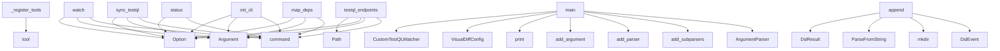

# System Architecture Analysis
<!-- generated in 0.00s -->

## Overview

- **Project**: /home/tom/github/semcod/wup
- **Primary Language**: python
- **Languages**: python: 98, json: 16, yaml: 12, txt: 12, toml: 7
- **Analysis Mode**: static
- **Total Functions**: 561
- **Total Classes**: 77
- **Modules**: 155
- **Entry Points**: 337

## Architecture by Module

### wup.testql_watcher
- **Functions**: 50
- **Classes**: 2
- **File**: `testql_watcher.py`

### wup.testql_monitor
- **Functions**: 39
- **Classes**: 3
- **File**: `testql_monitor.py`

### wup.core
- **Functions**: 31
- **Classes**: 2
- **File**: `core.py`

### wup.visual_diff
- **Functions**: 26
- **Classes**: 1
- **File**: `visual_diff.py`

### wup.assistant
- **Functions**: 24
- **Classes**: 1
- **File**: `assistant.py`

### wup.cli
- **Functions**: 23
- **File**: `cli.py`

### wup.monitoring_manifest
- **Functions**: 19
- **Classes**: 1
- **File**: `monitoring_manifest.py`

### wup.config
- **Functions**: 19
- **File**: `config.py`

### wup.dependency_mapper
- **Functions**: 16
- **Classes**: 1
- **File**: `dependency_mapper.py`

### wup.planfile_reporter
- **Functions**: 13
- **Classes**: 1
- **File**: `planfile_reporter.py`

### wup.cli_scanner
- **Functions**: 12
- **Classes**: 3
- **File**: `cli_scanner.py`

### wup.control
- **Functions**: 12
- **File**: `control.py`

### packages.dsl2wup.src.dsl2wup.handlers.command
- **Functions**: 10
- **File**: `command.py`

### wup.web_client
- **Functions**: 10
- **Classes**: 1
- **File**: `web_client.py`

### examples.c2004_monorepo_demo
- **Functions**: 10
- **File**: `c2004_monorepo_demo.py`

### examples.webhook_notifications
- **Functions**: 10
- **Classes**: 1
- **File**: `webhook_notifications.py`

### wup.cli_bridge
- **Functions**: 9
- **File**: `cli_bridge.py`

### wup._ast_detector
- **Functions**: 9
- **Classes**: 1
- **File**: `_ast_detector.py`

### examples.visual_diff_demo
- **Functions**: 9
- **File**: `visual_diff_demo.py`

### packages.dsl2wup.src.dsl2wup.pb_codec
- **Functions**: 8
- **File**: `pb_codec.py`

## Key Entry Points

Main execution flows into the system:

### packages.mcp2wup.src.mcp2wup.server.WupMCPServer._register_tools
- **Calls**: self.app.tool, self.app.tool, self.app.tool, self.app.tool, self.app.tool, self.app.tool, self.app.tool, self.app.tool

### wup.cli.map_deps
> Build dependency map by scanning the codebase.

Maps files → endpoints → services for intelligent testing.
- **Calls**: app.command, typer.Argument, typer.Option, typer.Option, typer.Option, None.resolve, wup.config.load_config, console.print

### wup.cli.testql_endpoints
> Discover endpoints from TestQL scenario files and build dependency map.
- **Calls**: app.command, typer.Argument, typer.Option, typer.Option, Path, console.print, console.print, console.print

### wup.cli.init_cli
> Automatically generate wup.yaml configuration and TestQL scenarios for CLI/shell services.

Scans the project for CLI commands (entry points, setup.py
- **Calls**: app.command, typer.Argument, typer.Option, typer.Option, typer.Option, typer.Option, None.resolve, console.print

### wup.cli.sync_testql
> Discover monitoring targets and document them in wup.yaml.

With ``--write``, appends/updates the auto-generated ``monitoring:`` block
(Docker Compose
- **Calls**: app.command, typer.Argument, typer.Option, typer.Option, typer.Option, None.resolve, wup.config.load_config, TestQLMonitor

### wup.cli.watch
> Watch one or more projects for file changes and run regression tests.

Pass several project directories to test them **simultaneously**
(``wup watch p
- **Calls**: app.command, typer.Argument, typer.Option, typer.Option, typer.Option, typer.Option, typer.Option, typer.Option

### packages.cli2wup.src.cli2wup.cli.main
- **Calls**: argparse.ArgumentParser, parser.add_subparsers, sub.add_parser, shell.add_argument, shell.add_argument, sub.add_parser, run.add_argument, run.add_argument

### packages.uri2wup.src.uri2wup.cli.main
- **Calls**: argparse.ArgumentParser, parser.add_subparsers, sub.add_parser, resolve.add_argument, resolve.add_argument, resolve.add_argument, sub.add_parser, decode.add_argument

### packages.dsl2wup.src.dsl2wup.events.EventStore.append
- **Calls**: DslEvent, self.path.parent.mkdir, result_pb2.DslEvent, pb.command.ParseFromString, DslResult, pb.result.CopyFrom, pb.SerializeToString, str

### wup.cli.status
> Show dependency map status and configuration.
- **Calls**: app.command, typer.Option, typer.Option, typer.Option, typer.Option, typer.Option, typer.Option, typer.Option

### examples.testql_integration.main
> Run WUP + TestQL integration demo.
- **Calls**: print, print, print, VisualDiffConfig, CustomTestQLWatcher, print, watcher.dependency_mapper.build_from_codebase, watcher.dependency_mapper.save

### wup.anomaly_detector.AnomalyDetector.print_report
> Print formatted report of anomalies.
- **Calls**: self.get_summary, console.print, console.print, Table, table.add_column, table.add_column, table.add_column, table.add_column

### wup.assistant.WupAssistant._review_and_validate
> Review and validate configuration.
- **Calls**: console.print, console.print, console.print, console.print, console.print, console.print, console.print, self._validate_config

### wup.testql_watcher.TestQLWatcher.run_detail_test
- **Calls**: list, self._get_config_endpoints_for_service, self._select_scenarios_for_service, self.console.print, len, len, self._run_testql, None.append

### wup.assistant.WupAssistant._setup_anomaly_detection
> Setup anomaly detection configuration.
- **Calls**: console.print, Confirm.ask, console.print, hasattr, AnomalyDetectionConfig, console.print, console.print, console.print

### wup.testql_watcher.TestQLWatcher._run_fleet_health_scenario
> Optional full TestQL run (not dry-run) for fleet-wide health scenarios.
- **Calls**: None.strip, Path, self._run_testql, self._summarize_health_scenario_failure, bool, self._write_track, self._record_health_transition, self.console.print

### packages.nlp2wup.src.nlp2wup.cli.main
- **Calls**: argparse.ArgumentParser, parser.add_subparsers, sub.add_parser, to_dsl_cmd.add_argument, to_dsl_cmd.add_argument, to_dsl_cmd.add_argument, sub.add_parser, apply_cmd.add_argument

### wup.cli.assistant
> Interactive configuration assistant for wup.yaml.

Guides you through setting up services, file watching, TestQL integration,
web dashboard, and visua
- **Calls**: app.command, typer.Option, typer.Option, typer.Argument, None.resolve, WupAssistant, assistant.run, project_path.exists

### wup.visual_diff.VisualDiffer.run_for_service
> Scan pages for *service*, diff against stored snapshots.
Returns list of diff results (one per page).
- **Calls**: self._pages_for_service, max, self._build_progress, self._print_scan_summary, wup.visual_diff._playwright_available, wup.visual_diff._warn_playwright_missing, int, len

### wup.testql_monitor.TestQLMonitor._add_hardware_usb_module_endpoints
> Expand hardware_usb_modules from wup.yaml into OqlOS + proxy API probes.
- **Calls**: None.rstrip, None.rstrip, getattr, raw.get, isinstance, None.strip, catalog.append, catalog.append

### wup.assistant.WupAssistant._configure_services
> Interactive service configuration.
- **Calls**: console.print, console.print, enumerate, Prompt.ask, console.print, self._add_service_interactive, len, self._edit_service

### wup.planfile_reporter.PlanfileReporter._create_ticket
- **Calls**: None.strip, None.strip, self._wait_for_planfile_store_ready, cmd.extend, cmd.extend, subprocess.run, self._files_option_unsupported, None.strip

### wup.cli.init
> Initialize a new wup.yaml configuration file.
- **Calls**: app.command, typer.Argument, typer.Option, None.resolve, wup.cli_bridge.run_init, Path, console.print, console.print

### wup._ast_detector.ASTDetector.detect
> Detect changes in Python file structure.
- **Calls**: None.endswith, file_path.read_text, ast.parse, self._extract_ast_info, self._snapshot_path, snap_path.exists, json.loads, self._compute_changes

### wup.visual_diff.VisualDiffer._check_page
- **Calls**: wup._ast_detector.ASTDetector._snapshot_path, wup.visual_diff._load_snapshot, wup.visual_diff._diff_snapshots, wup.visual_diff._detect_content_issues, max, wup.visual_diff._save_snapshot, wup.visual_diff._fetch_dom_snapshot, int

### wup.multi.MultiProjectWatcher.start_watching
> Start every watcher and process their queues concurrently.

Returns:
    False when no project yielded a valid path to watch (nothing was
    started)
- **Calls**: None.join, self.console.print, watcher.start_background_tasks, watcher.prepare_observer, observers.append, active.append, self.console.print, len

### wup.core.WupWatcher.__init__
> Initialize the WUP watcher.

Args:
    project_root: Path to the project root directory
    deps_file: Path to the dependency map JSON file
    cpu_th
- **Calls**: Path, DependencyMapper, set, deque, defaultdict, Console, PlanfileReporter, None.exists

### examples.testql_demo.simulate_testql_analysis
> Simulate WUP analysis on TestQL project.
- **Calls**: print, print, print, print, Path, print, print, print

### wup.assistant.WupAssistant._setup_watch
> Setup file watching configuration.
- **Calls**: console.print, console.print, enumerate, Confirm.ask, console.print, Confirm.ask, console.print, IntPrompt.ask

### wup._yaml_detector.YAMLStructureDetector.detect
- **Calls**: self._load_yaml, self._snapshot_path, self._extract_structure, snap_path.exists, snap_path.write_text, json.dumps, json.loads, self._compare_structures

## Process Flows

Key execution flows identified:

### Flow 1: _register_tools
```
_register_tools [packages.mcp2wup.src.mcp2wup.server.WupMCPServer]
```

### Flow 2: map_deps
```
map_deps [wup.cli]
```

### Flow 3: testql_endpoints
```
testql_endpoints [wup.cli]
```

### Flow 4: init_cli
```
init_cli [wup.cli]
```

### Flow 5: sync_testql
```
sync_testql [wup.cli]
```

### Flow 6: watch
```
watch [wup.cli]
```

### Flow 7: main
```
main [packages.cli2wup.src.cli2wup.cli]
```

### Flow 8: append
```
append [packages.dsl2wup.src.dsl2wup.events.EventStore]
```

### Flow 9: status
```
status [wup.cli]
```

### Flow 10: print_report
```
print_report [wup.anomaly_detector.AnomalyDetector]
```

## Key Classes

### wup.testql_watcher.TestQLWatcher
> WUP watcher running selective TestQL scenarios for changed services.
- **Methods**: 48
- **Key Methods**: wup.testql_watcher.TestQLWatcher.__init__, wup.testql_watcher.TestQLWatcher._normalize_fleet_health_entry, wup.testql_watcher.TestQLWatcher._load_service_health, wup.testql_watcher.TestQLWatcher._record_health_transition, wup.testql_watcher.TestQLWatcher._tokenize_service, wup.testql_watcher.TestQLWatcher._get_config_endpoints_for_service, wup.testql_watcher.TestQLWatcher._to_full_url_for_service, wup.testql_watcher.TestQLWatcher._resolve_base_url_for_service, wup.testql_watcher.TestQLWatcher._resolve_base_url, wup.testql_watcher.TestQLWatcher._to_full_url
- **Inherits**: WupWatcher

### wup.core.WupWatcher
> Intelligent file watcher for regression testing.

Implements 3-layer testing:
1. Detection Layer: Fi
- **Methods**: 27
- **Key Methods**: wup.core.WupWatcher.__init__, wup.core.WupWatcher._to_relative_path, wup.core.WupWatcher.infer_service, wup.core.WupWatcher._is_coincident_pair, wup.core.WupWatcher.detect_service_coincidences, wup.core.WupWatcher._services_share_domain, wup.core.WupWatcher.get_service_config, wup.core.WupWatcher.should_test, wup.core.WupWatcher.schedule_quick_test, wup.core.WupWatcher.schedule_detail_test

### wup.assistant.WupAssistant
> Interactive configuration assistant.
- **Methods**: 23
- **Key Methods**: wup.assistant.WupAssistant.__init__, wup.assistant.WupAssistant._dispatch_menu_choice, wup.assistant.WupAssistant.run, wup.assistant.WupAssistant._init_project, wup.assistant.WupAssistant._detect_framework, wup.assistant.WupAssistant._auto_detect_services, wup.assistant.WupAssistant._detect_service_type, wup.assistant.WupAssistant._configure_services, wup.assistant.WupAssistant._add_service_interactive, wup.assistant.WupAssistant._edit_service

### wup.testql_monitor.TestQLMonitor
> Build and run live probes from TestQL scenarios + WUP config.
- **Methods**: 17
- **Key Methods**: wup.testql_monitor.TestQLMonitor.__init__, wup.testql_monitor.TestQLMonitor._load_dot_env, wup.testql_monitor.TestQLMonitor._build_port_map, wup.testql_monitor.TestQLMonitor._service_map_paths, wup.testql_monitor.TestQLMonitor._add_hardware_usb_module_endpoints, wup.testql_monitor.TestQLMonitor._add_config_endpoints, wup.testql_monitor.TestQLMonitor._add_scenario_probes, wup.testql_monitor.TestQLMonitor._add_service_map_probes, wup.testql_monitor.TestQLMonitor.discover_probes_by_service, wup.testql_monitor.TestQLMonitor._resolve_base_url_for_service

### wup.dependency_mapper.DependencyMapper
> Maps project dependencies for intelligent testing.
- **Methods**: 16
- **Key Methods**: wup.dependency_mapper.DependencyMapper.__init__, wup.dependency_mapper.DependencyMapper.build_from_codebase, wup.dependency_mapper.DependencyMapper._detect_framework, wup.dependency_mapper.DependencyMapper._search_codebase, wup.dependency_mapper.DependencyMapper._scan_endpoints, wup.dependency_mapper.DependencyMapper._scan_python_endpoints, wup.dependency_mapper.DependencyMapper._scan_js_endpoints, wup.dependency_mapper.DependencyMapper._infer_service, wup.dependency_mapper.DependencyMapper.get_endpoints_for_file, wup.dependency_mapper.DependencyMapper.get_endpoints_for_service

### wup.planfile_reporter.PlanfileReporter
> Create deduplicated planfile tickets for WUP-detected failures.
- **Methods**: 14
- **Key Methods**: wup.planfile_reporter.PlanfileReporter.__init__, wup.planfile_reporter.PlanfileReporter.enabled, wup.planfile_reporter.PlanfileReporter.report_failure, wup.planfile_reporter.PlanfileReporter._ticket_is_closed, wup.planfile_reporter.PlanfileReporter.clear_service_stage, wup.planfile_reporter.PlanfileReporter._create_ticket, wup.planfile_reporter.PlanfileReporter._wait_for_planfile_store_ready, wup.planfile_reporter.PlanfileReporter._load_dedupe, wup.planfile_reporter.PlanfileReporter._save_dedupe, wup.planfile_reporter.PlanfileReporter._fingerprint

### wup.cli_scanner.CLIScanner
> Scanner for detecting CLI commands in a project.
- **Methods**: 12
- **Key Methods**: wup.cli_scanner.CLIScanner.__init__, wup.cli_scanner.CLIScanner.scan, wup.cli_scanner.CLIScanner._scan_setup_py, wup.cli_scanner.CLIScanner._scan_setup_cfg, wup.cli_scanner.CLIScanner._scan_pyproject_toml, wup.cli_scanner.CLIScanner._scan_main_modules, wup.cli_scanner.CLIScanner._parse_entry_points_dict, wup.cli_scanner.CLIScanner._add_entry_point, wup.cli_scanner.CLIScanner.infer_command_args, wup.cli_scanner.CLIScanner._find_module_path

### wup._ast_detector.ASTDetector
> Detect changes in Python files using AST comparison.
- **Methods**: 9
- **Key Methods**: wup._ast_detector.ASTDetector.__init__, wup._ast_detector.ASTDetector._collect_import, wup._ast_detector.ASTDetector._collect_import_from, wup._ast_detector.ASTDetector._collect_class, wup._ast_detector.ASTDetector._collect_function, wup._ast_detector.ASTDetector._extract_ast_info, wup._ast_detector.ASTDetector._snapshot_path, wup._ast_detector.ASTDetector._compute_changes, wup._ast_detector.ASTDetector.detect
- **Inherits**: BaseDetector

### wup.visual_diff.VisualDiffer
> Triggered by TestQLWatcher after a file change.

Usage::

    differ = VisualDiffer(project_root, co
- **Methods**: 9
- **Key Methods**: wup.visual_diff.VisualDiffer.__init__, wup.visual_diff.VisualDiffer._pages_for_service, wup.visual_diff.VisualDiffer._categorize_page_result, wup.visual_diff.VisualDiffer._print_scan_summary, wup.visual_diff.VisualDiffer.run_for_service, wup.visual_diff.VisualDiffer._build_progress, wup.visual_diff.VisualDiffer._check_page, wup.visual_diff.VisualDiffer._write_diff_event, wup.visual_diff.VisualDiffer.get_recent_diffs

### wup.web_client.WebClient
> Async event sink for the wupbro backend.

Usage::

    client = WebClient(config.web)
    await clie
- **Methods**: 8
- **Key Methods**: wup.web_client.WebClient.__init__, wup.web_client.WebClient.is_active, wup.web_client.WebClient._headers, wup.web_client.WebClient.send_event, wup.web_client.WebClient.send_regression, wup.web_client.WebClient.send_pass, wup.web_client.WebClient.send_health_transition, wup.web_client.WebClient.send_visual_diff

### wup._yaml_detector.YAMLStructureDetector
> Detect structural changes in YAML files.
- **Methods**: 8
- **Key Methods**: wup._yaml_detector.YAMLStructureDetector.__init__, wup._yaml_detector.YAMLStructureDetector._load_yaml, wup._yaml_detector.YAMLStructureDetector._extract_structure, wup._yaml_detector.YAMLStructureDetector._snapshot_path, wup._yaml_detector.YAMLStructureDetector._compare_structures, wup._yaml_detector.YAMLStructureDetector._compare_dict_structures, wup._yaml_detector.YAMLStructureDetector.detect, wup._yaml_detector.YAMLStructureDetector._generate_suggestions
- **Inherits**: BaseDetector

### wup.testql_discovery.TestQLEndpointDiscovery
> Discover endpoints from TestQL scenario files.
- **Methods**: 7
- **Key Methods**: wup.testql_discovery.TestQLEndpointDiscovery.__init__, wup.testql_discovery.TestQLEndpointDiscovery.discover_scenarios, wup.testql_discovery.TestQLEndpointDiscovery.parse_scenario_endpoints, wup.testql_discovery.TestQLEndpointDiscovery.infer_service_from_scenario, wup.testql_discovery.TestQLEndpointDiscovery.discover_all_endpoints, wup.testql_discovery.TestQLEndpointDiscovery.discover_via_testql_cli, wup.testql_discovery.TestQLEndpointDiscovery.to_dependency_map

### wup.testql_cli_generator.TestQLCLIGenerator
> Generate TestQL scenarios for CLI command testing.
- **Methods**: 6
- **Key Methods**: wup.testql_cli_generator.TestQLCLIGenerator.__init__, wup.testql_cli_generator.TestQLCLIGenerator.generate, wup.testql_cli_generator.TestQLCLIGenerator._generate_smoke_scenario, wup.testql_cli_generator.TestQLCLIGenerator._generate_command_scenario, wup.testql_cli_generator.TestQLCLIGenerator.generate_custom_scenario, wup.testql_cli_generator.TestQLCLIGenerator.print_summary

### wup.anomaly_detector.AnomalyDetector
> Main anomaly detector combining multiple detection methods.
- **Methods**: 6
- **Key Methods**: wup.anomaly_detector.AnomalyDetector.__init__, wup.anomaly_detector.AnomalyDetector._should_scan, wup.anomaly_detector.AnomalyDetector.scan_file, wup.anomaly_detector.AnomalyDetector.scan_directory, wup.anomaly_detector.AnomalyDetector.get_summary, wup.anomaly_detector.AnomalyDetector.print_report

### wup.cli_config_generator.CLIConfigGenerator
> Generate wup.yaml configuration for CLI/shell services.
- **Methods**: 6
- **Key Methods**: wup.cli_config_generator.CLIConfigGenerator.__init__, wup.cli_config_generator.CLIConfigGenerator.generate, wup.cli_config_generator.CLIConfigGenerator._generate_config, wup.cli_config_generator.CLIConfigGenerator._create_shell_service, wup.cli_config_generator.CLIConfigGenerator._save_config, wup.cli_config_generator.CLIConfigGenerator.print_summary

### wup.bus.EventBus
> Simple in-memory event bus and command/query dispatcher.
- **Methods**: 5
- **Key Methods**: wup.bus.EventBus.__init__, wup.bus.EventBus.subscribe, wup.bus.EventBus.publish, wup.bus.EventBus.execute, wup.bus.EventBus.query

### wup.testing.handlers.health_handlers.ServiceHealthProjection
> Maintains the materialized view of service health.
- **Methods**: 5
- **Key Methods**: wup.testing.handlers.health_handlers.ServiceHealthProjection.__init__, wup.testing.handlers.health_handlers.ServiceHealthProjection._load_initial_state, wup.testing.handlers.health_handlers.ServiceHealthProjection._save_state, wup.testing.handlers.health_handlers.ServiceHealthProjection.handle_health_changed, wup.testing.handlers.health_handlers.ServiceHealthProjection.handle_get_health

### examples.testql_integration.CustomTestQLWatcher
> Custom WUP watcher integrated with TestQL test framework.

Overrides test methods to run actual Test
- **Methods**: 5
- **Key Methods**: examples.testql_integration.CustomTestQLWatcher.__init__, examples.testql_integration.CustomTestQLWatcher.run_quick_test, examples.testql_integration.CustomTestQLWatcher.run_detail_test, examples.testql_integration.CustomTestQLWatcher._find_scenarios_for_service, examples.testql_integration.CustomTestQLWatcher._generate_blame_report
- **Inherits**: WupWatcher

### examples.webhook_notifications.NotificationRouter
> Routes WUP events to configured notification channels.
- **Methods**: 5
- **Key Methods**: examples.webhook_notifications.NotificationRouter.__init__, examples.webhook_notifications.NotificationRouter.add_slack, examples.webhook_notifications.NotificationRouter.add_teams, examples.webhook_notifications.NotificationRouter.add_discord, examples.webhook_notifications.NotificationRouter.send

### wup._hash_detector.HashDetector
> Fast anomaly detection using file hashes.
- **Methods**: 4
- **Key Methods**: wup._hash_detector.HashDetector.__init__, wup._hash_detector.HashDetector._compute_hash, wup._hash_detector.HashDetector._snapshot_path, wup._hash_detector.HashDetector.detect
- **Inherits**: BaseDetector

## Data Transformation Functions

Key functions that process and transform data:

### packages.uri2wup.src.uri2wup.decode.decode_uri
> Convert wup:// URI to a canonical DSL command line.
- **Output to**: packages.uri2wup.src.uri2wup.uri.parse_wup_uri, str, list, isinstance, ValueError

### packages.uri2wup.src.uri2wup.uri._encode
- **Output to**: quote

### packages.uri2wup.src.uri2wup.uri._decode
- **Output to**: unquote

### packages.uri2wup.src.uri2wup.uri.parse_wup_uri
- **Output to**: urlparse, packages.uri2wup.src.uri2wup.uri._decode, packages.uri2wup.src.uri2wup.uri.is_wup_uri, ValueError, packages.uri2wup.src.uri2wup.uri._decode

### packages.nlp2wup.src.nlp2wup.validate.validate_wup_config
- **Output to**: wup.validate.validate_wup_file

### packages.dsl2wup.src.dsl2wup.pb_codec.encode_protobuf
- **Output to**: command_pb2.DslEnvelope, None.upper, packages.dsl2wup.src.dsl2wup.pb_codec._set_body, envelope.SerializeToString, str

### packages.dsl2wup.src.dsl2wup.pb_codec.decode_protobuf
- **Output to**: command_pb2.DslEnvelope, envelope.ParseFromString, packages.dsl2wup.src.dsl2wup.pb_codec.envelope_to_dict

### packages.dsl2wup.src.dsl2wup.pb_codec.encode_text_to_protobuf
- **Output to**: packages.dsl2wup.src.dsl2wup.grammar.parse_line, packages.dsl2wup.src.dsl2wup.pb_codec.encode_protobuf, ValueError

### packages.dsl2wup.src.dsl2wup.pb_codec.decode_protobuf_to_text
- **Output to**: packages.dsl2wup.src.dsl2wup.grammar.to_text, packages.dsl2wup.src.dsl2wup.pb_codec.decode_protobuf

### packages.dsl2wup.src.dsl2wup.pb_codec.encode_result_protobuf
- **Output to**: None.SerializeToString, packages.dsl2wup.src.dsl2wup.pb_codec.result_to_pb

### packages.dsl2wup.src.dsl2wup.schema_registry.validate_command_dict
- **Output to**: None.upper, packages.dsl2wup.src.dsl2wup.schema_registry.schema_for_verb, jsonschema.Draft202012Validator, str, sorted

### packages.dsl2wup.src.dsl2wup.schema_registry.validate_schema_registry
> Audit registry: handler verbs, schema files, protobuf codec alignment.
- **Output to**: packages.dsl2wup.src.dsl2wup.schema_registry._load_schemas, schemas.items, sorted, set, sorted

### packages.dsl2wup.src.dsl2wup.grammar.parse_line
- **Output to**: packages.dsl2wup.src.dsl2wup.grammar.split_command, None.upper, packages.dsl2wup.src.dsl2wup.grammar.pick_flag, packages.dsl2wup.src.dsl2wup.grammar.pick_flag, f.lower

### packages.dsl2wup.src.dsl2wup.codec.encode_text
- **Output to**: packages.dsl2wup.src.dsl2wup.grammar.parse_line, packages.dsl2wup.src.dsl2wup.schema_registry.validate_command_dict

### packages.dsl2wup.src.dsl2wup.codec.encode_protobuf
- **Output to**: packages.dsl2wup.src.dsl2wup.pb_codec.encode_text_to_protobuf

### packages.dsl2wup.src.dsl2wup.codec.decode_protobuf
- **Output to**: packages.dsl2wup.src.dsl2wup.pb_codec.decode_protobuf_to_text

### packages.dsl2wup.src.dsl2wup.handlers.query.handle_validate
- **Output to**: str, wup.validate.validate_wup_file, DslResult, packages.dsl2wup.src.dsl2wup.handlers.query._project_root, cmd.get

### wup.monitoring_manifest._parse_port_mapping
- **Output to**: isinstance, isinstance, str, str

### wup.monitoring_manifest.format_manifest_summary
> Short human-readable summary for CLI.
- **Output to**: lines.append, lines.append, manifest.get, sorted, semcod.get

### wup.cli_bridge.run_validate
- **Output to**: wup.control.dispatch_validate

### wup.testql_monitor._parse_api_lines
- **Output to**: _API_LINE.findall, probes.append, int, ProbeTarget, target.strip

### wup.testql_monitor._parse_shell_curl_lines
- **Output to**: _SHELL_CURL_URL.findall, None.rstrip, probes.append, ProbeTarget, url.strip

### wup.testql_monitor.parse_scenario_probes
> Extract API probe rows from a TestQL TOON scenario file.
- **Output to**: scenario_path.read_text, wup.testql_monitor._parse_api_lines, wup.testql_monitor._parse_shell_curl_lines, str, str

### wup.testql_monitor._parse_endpoint_row
> Convert a single endpoints list entry into a ProbeTarget.
- **Output to**: None.strip, None.upper, int, ProbeTarget, isinstance

### wup.testql_monitor.parse_service_map_probes
> Extract probes from c2004-style service map YAML (endpoints: list).
- **Output to**: wup.testql_monitor._extract_base_url, str, yaml.safe_load, isinstance, data.get

## Behavioral Patterns

### recursion__normalize
- **Type**: recursion
- **Confidence**: 0.90
- **Functions**: wup.web_client._normalize

### recursion__flatten
- **Type**: recursion
- **Confidence**: 0.90
- **Functions**: wup.visual_diff._flatten

### state_machine_ServiceHealthProjection
- **Type**: state_machine
- **Confidence**: 0.70
- **Functions**: wup.testing.handlers.health_handlers.ServiceHealthProjection.__init__, wup.testing.handlers.health_handlers.ServiceHealthProjection._load_initial_state, wup.testing.handlers.health_handlers.ServiceHealthProjection._save_state, wup.testing.handlers.health_handlers.ServiceHealthProjection.handle_health_changed, wup.testing.handlers.health_handlers.ServiceHealthProjection.handle_get_health

## Public API Surface

Functions exposed as public API (no underscore prefix):

- `examples.ci_cd_integration.show_ci_cd_demo` - 69 calls
- `examples.webhook_notifications.show_webhook_demo` - 68 calls
- `packages.uri2wup.src.uri2wup.query.query_uri` - 49 calls
- `wup.cli.map_deps` - 45 calls
- `wup.cli.testql_endpoints` - 43 calls
- `packages.rest2wup.src.rest2wup.app.create_app` - 42 calls
- `packages.dsl2wup.src.dsl2wup.codegen.generate_models` - 42 calls
- `wup.cli.init_cli` - 42 calls
- `wup.cli.sync_testql` - 38 calls
- `packages.dsl2wup.src.dsl2wup.grammar.parse_line` - 37 calls
- `wup.monitoring_manifest.format_manifest_summary` - 36 calls
- `wup.cli.watch` - 36 calls
- `packages.cli2wup.src.cli2wup.cli.main` - 34 calls
- `packages.uri2wup.src.uri2wup.cli.main` - 34 calls
- `packages.dsl2wup.src.dsl2wup.events.EventStore.append` - 33 calls
- `wup.cli.status` - 31 calls
- `wup.status_data.collect_status_snapshot` - 30 calls
- `examples.testql_integration.main` - 27 calls
- `wup.anomaly_detector.AnomalyDetector.print_report` - 26 calls
- `wup.endpoints.discover_testql_endpoints` - 26 calls
- `wup.init_cli.setup_cli_project` - 26 calls
- `examples.c2004_monorepo_demo.analyze_monorepo` - 26 calls
- `examples.visual_diff_demo.demo_snapshot_persistence` - 26 calls
- `wup.testql_watcher.TestQLWatcher.run_detail_test` - 25 calls
- `packages.uri2wup.src.uri2wup.decode.decode_uri` - 23 calls
- `packages.nlp2wup.src.nlp2wup.cli.main` - 22 calls
- `wup.cli.assistant` - 22 calls
- `wup.visual_diff.VisualDiffer.run_for_service` - 22 calls
- `packages.uri2wup.src.uri2wup.patch.patch_uri` - 21 calls
- `packages.dsl2wup.src.dsl2wup.handlers.command.handle_from_tokens` - 21 calls
- `packages.nlp2wup.src.nlp2wup.apply.to_dsl` - 20 calls
- `packages.dsl2wup.src.dsl2wup.handlers.command.handle_map` - 20 calls
- `packages.dsl2wup.src.dsl2wup.handlers.command.handle_adopt` - 20 calls
- `wup.generate.generate_wup_config` - 20 calls
- `packages.dsl2wup.src.dsl2wup.schema_registry.validate_schema_registry` - 19 calls
- `packages.dsl2wup.src.dsl2wup.grammar.to_text` - 19 calls
- `wup.cli.init` - 19 calls
- `wup._ast_detector.ASTDetector.detect` - 19 calls
- `wup.multi.MultiProjectWatcher.start_watching` - 18 calls
- `examples.testql_demo.simulate_testql_analysis` - 18 calls

## System Interactions

How components interact:


```mermaid
graph TD
    _register_tools --> tool
    map_deps --> command
    map_deps --> Argument
    map_deps --> Option
    testql_endpoints --> command
    testql_endpoints --> Argument
    testql_endpoints --> Option
    testql_endpoints --> Path
    init_cli --> command
    init_cli --> Argument
    init_cli --> Option
    sync_testql --> command
    sync_testql --> Argument
    sync_testql --> Option
    watch --> command
    watch --> Argument
    watch --> Option
    main --> ArgumentParser
    main --> add_subparsers
    main --> add_parser
    main --> add_argument
    append --> DslEvent
    append --> mkdir
    append --> ParseFromString
    append --> DslResult
    status --> command
    status --> Option
    main --> print
    main --> VisualDiffConfig
    main --> CustomTestQLWatcher
```

## Reverse Engineering Guidelines

1. **Entry Points**: Start analysis from the entry points listed above
2. **Core Logic**: Focus on classes with many methods
3. **Data Flow**: Follow data transformation functions
4. **Process Flows**: Use the flow diagrams for execution paths
5. **API Surface**: Public API functions reveal the interface

## Context for LLM

Maintain the identified architectural patterns and public API surface when suggesting changes.