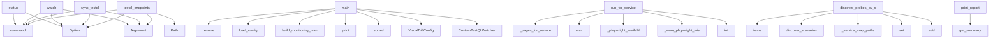

# System Architecture Analysis
<!-- generated in 0.00s -->

## Overview

- **Project**: /home/tom/github/semcod/wup
- **Primary Language**: python
- **Languages**: python: 37, yaml: 8, txt: 4, json: 2, shell: 1
- **Analysis Mode**: static
- **Total Functions**: 284
- **Total Classes**: 32
- **Modules**: 56
- **Entry Points**: 217

## Architecture by Module

### wup.testql_watcher
- **Functions**: 35
- **Classes**: 2
- **File**: `testql_watcher.py`

### wup.core
- **Functions**: 25
- **Classes**: 2
- **File**: `core.py`

### wup.assistant
- **Functions**: 24
- **Classes**: 1
- **File**: `assistant.py`

### wup.visual_diff
- **Functions**: 22
- **Classes**: 1
- **File**: `visual_diff.py`

### wup.testql_monitor
- **Functions**: 20
- **Classes**: 2
- **File**: `testql_monitor.py`

### wup.dependency_mapper
- **Functions**: 16
- **Classes**: 1
- **File**: `dependency_mapper.py`

### wup.monitoring_manifest
- **Functions**: 10
- **Classes**: 1
- **File**: `monitoring_manifest.py`

### wup.web_client
- **Functions**: 10
- **Classes**: 1
- **File**: `web_client.py`

### examples.c2004_monorepo_demo
- **Functions**: 10
- **File**: `c2004_monorepo_demo.py`

### examples.webhook_notifications
- **Functions**: 10
- **Classes**: 1
- **File**: `webhook_notifications.py`

### wup._ast_detector
- **Functions**: 9
- **Classes**: 1
- **File**: `_ast_detector.py`

### examples.visual_diff_demo
- **Functions**: 9
- **File**: `visual_diff_demo.py`

### wup.cli
- **Functions**: 9
- **File**: `cli.py`

### wup.anomaly_detector
- **Functions**: 8
- **Classes**: 1
- **File**: `anomaly_detector.py`

### wup._yaml_detector
- **Functions**: 8
- **Classes**: 1
- **File**: `_yaml_detector.py`

### wup.testql_discovery
- **Functions**: 7
- **Classes**: 1
- **File**: `testql_discovery.py`

### examples.testql_integration
- **Functions**: 6
- **Classes**: 1
- **File**: `testql_integration.py`

### wup.config
- **Functions**: 6
- **File**: `config.py`

### examples.flask-app.app.auth.routes
- **Functions**: 5
- **File**: `routes.py`

### examples.fastapi-app.app.users.routes
- **Functions**: 5
- **Classes**: 1
- **File**: `routes.py`

## Key Entry Points

Main execution flows into the system:

### wup.cli.status
> Show dependency map status and configuration.
- **Calls**: app.command, typer.Option, typer.Option, typer.Option, typer.Option, typer.Option, typer.Option, None.resolve

### wup.cli.watch
> Watch project for file changes and run regression tests.

Defaults (no extra flags): ``--mode testql`` and live probes every **60s**
(unless ``testql.
- **Calls**: app.command, typer.Argument, typer.Option, typer.Option, typer.Option, typer.Option, typer.Option, typer.Option

### wup.cli.sync_testql
> Discover monitoring targets and document them in wup.yaml.

With ``--write``, appends/updates the auto-generated ``monitoring:`` block
(Docker Compose
- **Calls**: app.command, typer.Argument, typer.Option, typer.Option, typer.Option, None.resolve, wup.config.load_config, TestQLMonitor

### wup.cli.testql_endpoints
> Discover endpoints from TestQL scenario files and build dependency map.
- **Calls**: app.command, typer.Argument, typer.Option, typer.Option, Path, console.print, console.print, console.print

### scripts.run_probe_smoke.main
- **Calls**: None.resolve, wup.config.load_config, wup.monitoring_manifest.build_monitoring_manifest, print, sorted, TestQLWatcher, print, print

### wup.visual_diff.VisualDiffer.run_for_service
> Scan pages for *service*, diff against stored snapshots.
Returns list of diff results (one per page).
- **Calls**: self._pages_for_service, max, wup.visual_diff._playwright_available, wup.visual_diff._warn_playwright_missing, int, len, results.append, console.print

### examples.testql_integration.main
> Run WUP + TestQL integration demo.
- **Calls**: print, print, print, VisualDiffConfig, CustomTestQLWatcher, print, watcher.dependency_mapper.build_from_codebase, watcher.dependency_mapper.save

### wup.testql_monitor.TestQLMonitor.discover_probes_by_service
> Discover monitoring probes grouped by WUP service name.
- **Calls**: None.items, self.discovery.discover_scenarios, self._service_map_paths, set, None.add, None.append, self._resolve_base_url_for_service, ProbeTarget

### wup.anomaly_detector.AnomalyDetector.print_report
> Print formatted report of anomalies.
- **Calls**: self.get_summary, console.print, console.print, Table, table.add_column, table.add_column, table.add_column, table.add_column

### wup.assistant.WupAssistant._review_and_validate
> Review and validate configuration.
- **Calls**: console.print, console.print, console.print, console.print, console.print, console.print, console.print, self._validate_config

### wup.cli.map_deps
> Build dependency map from codebase.
- **Calls**: app.command, typer.Argument, typer.Option, typer.Option, None.resolve, console.print, console.print, console.print

### wup.assistant.WupAssistant._setup_anomaly_detection
> Setup anomaly detection configuration.
- **Calls**: console.print, Confirm.ask, console.print, hasattr, AnomalyDetectionConfig, console.print, console.print, console.print

### wup.assistant.WupAssistant._configure_services
> Interactive service configuration.
- **Calls**: console.print, console.print, enumerate, Prompt.ask, console.print, self._add_service_interactive, len, self._edit_service

### wup.testql_watcher.TestQLWatcher._run_fleet_health_scenario
> Optional full TestQL run (not dry-run) for fleet-wide health scenarios.
- **Calls**: None.strip, Path, self._run_testql, self._summarize_health_scenario_failure, self._write_track, bool, self._record_health_transition, self.console.print

### wup.testql_watcher.TestQLWatcher.run_detail_test
- **Calls**: list, self._get_config_endpoints_for_service, self._select_scenarios_for_service, self.console.print, len, len, self._run_testql, None.append

### wup._ast_detector.ASTDetector.detect
> Detect changes in Python file structure.
- **Calls**: None.endswith, file_path.read_text, ast.parse, self._extract_ast_info, self._snapshot_path, snap_path.exists, json.loads, self._compute_changes

### examples.testql_demo.simulate_testql_analysis
> Simulate WUP analysis on TestQL project.
- **Calls**: print, print, print, print, Path, print, print, print

### wup.assistant.WupAssistant._setup_watch
> Setup file watching configuration.
- **Calls**: console.print, console.print, enumerate, Confirm.ask, console.print, Confirm.ask, console.print, IntPrompt.ask

### wup.core.WupWatcher.__init__
> Initialize the WUP watcher.

Args:
    project_root: Path to the project root directory
    deps_file: Path to the dependency map JSON file
    cpu_th
- **Calls**: Path, DependencyMapper, set, deque, defaultdict, Console, None.exists, wup.config.load_config

### wup._yaml_detector.YAMLStructureDetector.detect
- **Calls**: self._load_yaml, self._snapshot_path, self._extract_structure, snap_path.exists, snap_path.write_text, json.dumps, json.loads, self._compare_structures

### wup.assistant.WupAssistant._setup_visual_diff
> Setup visual diff configuration.
- **Calls**: console.print, Confirm.ask, console.print, Prompt.ask, console.print, enumerate, Confirm.ask, console.print

### wup.dependency_mapper.DependencyMapper._scan_python_endpoints
> Scan Python files for endpoint definitions.
- **Calls**: self.project_root.rglob, py_file.read_text, str, py_file.relative_to, re.findall, endpoints.append, re.findall, None.split

### wup.testql_discovery.TestQLEndpointDiscovery.parse_scenario_endpoints
> Extract endpoints from a TestQL scenario file.

Args:
    scenario_path: Path to scenario file
    
Returns:
    List of endpoint paths found in the s
- **Calls**: list, re.compile, api_pattern.findall, set, open, f.read, endpoints.append, yaml.safe_load

### wup._hash_detector.HashDetector.detect
> Detect changes using hash comparison.
- **Calls**: file_path.read_text, self._compute_hash, self._snapshot_path, snap_path.exists, file_path.exists, None.strip, snap_path.write_text, AnomalyResult

### wup.cli.init
> Initialize a new wup.yaml configuration file.
- **Calls**: app.command, typer.Argument, typer.Option, None.resolve, Path, output_path.exists, wup.config.get_default_config, wup.config.save_config

### wup._ast_detector.ASTDetector._extract_ast_info
- **Calls**: ast.iter_child_nodes, _handlers.get, None.extend, None.append, None.append, None.append, type, handler

### wup.core.WupWatcher.infer_service
> Infer service name from file path.

Uses config services first, then dependency mapper, then heuristics.
- **Calls**: self._to_relative_path, self.dependency_mapper.get_service_for_file, _re.match, len, None.is_file, None.join, None.lower, svc.name.lower

### wup.core.WupWatcher.start_watching
> Start watching for file changes.

Args:
    watch_paths: List of paths to watch (default: from config or common source directories)
- **Calls**: WupEventHandler, Observer, observer.start, self.console.print, observer.join, self.build_watched_paths, self.console.print, observer.schedule

### wup.core.WupWatcher.run_with_dashboard
> Run watcher with live dashboard.
- **Calls**: self.build_watched_paths, WupEventHandler, Observer, observer.start, observer.join, observer.schedule, Live, None.exists

### examples.visual_diff_demo.main
- **Calls**: print, print, print, examples.visual_diff_demo.demo_diff_algorithm, examples.visual_diff_demo.demo_page_slug, examples.visual_diff_demo.demo_snapshot_persistence, examples.visual_diff_demo.demo_config_yaml_round_trip, examples.visual_diff_demo.demo_disabled_is_noop

## Process Flows

Key execution flows identified:

### Flow 1: status
```
status [wup.cli]
```

### Flow 2: watch
```
watch [wup.cli]
```

### Flow 3: sync_testql
```
sync_testql [wup.cli]
```

### Flow 4: testql_endpoints
```
testql_endpoints [wup.cli]
```

### Flow 5: main
```
main [scripts.run_probe_smoke]
  └─ →> load_config
      └─> _load_dotenv
      └─> validate_config
  └─ →> build_monitoring_manifest
      └─> discover_docker_compose_services
      └─> _map_docker_to_wup_service
```

### Flow 6: run_for_service
```
run_for_service [wup.visual_diff.VisualDiffer]
  └─ →> _playwright_available
  └─ →> _warn_playwright_missing
```

### Flow 7: discover_probes_by_service
```
discover_probes_by_service [wup.testql_monitor.TestQLMonitor]
```

### Flow 8: print_report
```
print_report [wup.anomaly_detector.AnomalyDetector]
```

### Flow 9: _review_and_validate
```
_review_and_validate [wup.assistant.WupAssistant]
```

### Flow 10: map_deps
```
map_deps [wup.cli]
```

## Key Classes

### wup.testql_watcher.TestQLWatcher
> WUP watcher running selective TestQL scenarios for changed services.
- **Methods**: 33
- **Key Methods**: wup.testql_watcher.TestQLWatcher.__init__, wup.testql_watcher.TestQLWatcher._normalize_fleet_health_entry, wup.testql_watcher.TestQLWatcher._load_service_health, wup.testql_watcher.TestQLWatcher._save_service_health, wup.testql_watcher.TestQLWatcher._record_health_transition, wup.testql_watcher.TestQLWatcher._tokenize_service, wup.testql_watcher.TestQLWatcher._get_config_endpoints_for_service, wup.testql_watcher.TestQLWatcher._to_full_url_for_service, wup.testql_watcher.TestQLWatcher._resolve_base_url_for_service, wup.testql_watcher.TestQLWatcher._resolve_base_url
- **Inherits**: WupWatcher

### wup.assistant.WupAssistant
> Interactive configuration assistant.
- **Methods**: 23
- **Key Methods**: wup.assistant.WupAssistant.__init__, wup.assistant.WupAssistant._dispatch_menu_choice, wup.assistant.WupAssistant.run, wup.assistant.WupAssistant._init_project, wup.assistant.WupAssistant._detect_framework, wup.assistant.WupAssistant._auto_detect_services, wup.assistant.WupAssistant._detect_service_type, wup.assistant.WupAssistant._configure_services, wup.assistant.WupAssistant._add_service_interactive, wup.assistant.WupAssistant._edit_service

### wup.core.WupWatcher
> Intelligent file watcher for regression testing.

Implements 3-layer testing:
1. Detection Layer: Fi
- **Methods**: 21
- **Key Methods**: wup.core.WupWatcher.__init__, wup.core.WupWatcher._to_relative_path, wup.core.WupWatcher.infer_service, wup.core.WupWatcher._is_coincident_pair, wup.core.WupWatcher.detect_service_coincidences, wup.core.WupWatcher._services_share_domain, wup.core.WupWatcher.get_service_config, wup.core.WupWatcher.should_test, wup.core.WupWatcher.schedule_quick_test, wup.core.WupWatcher.schedule_detail_test

### wup.dependency_mapper.DependencyMapper
> Maps project dependencies for intelligent testing.
- **Methods**: 16
- **Key Methods**: wup.dependency_mapper.DependencyMapper.__init__, wup.dependency_mapper.DependencyMapper.build_from_codebase, wup.dependency_mapper.DependencyMapper._detect_framework, wup.dependency_mapper.DependencyMapper._search_codebase, wup.dependency_mapper.DependencyMapper._scan_endpoints, wup.dependency_mapper.DependencyMapper._scan_python_endpoints, wup.dependency_mapper.DependencyMapper._scan_js_endpoints, wup.dependency_mapper.DependencyMapper._infer_service, wup.dependency_mapper.DependencyMapper.get_endpoints_for_file, wup.dependency_mapper.DependencyMapper.get_endpoints_for_service

### wup.testql_monitor.TestQLMonitor
> Build and run live probes from TestQL scenarios + WUP config.
- **Methods**: 11
- **Key Methods**: wup.testql_monitor.TestQLMonitor.__init__, wup.testql_monitor.TestQLMonitor._service_map_paths, wup.testql_monitor.TestQLMonitor.discover_probes_by_service, wup.testql_monitor.TestQLMonitor._resolve_base_url_for_service, wup.testql_monitor.TestQLMonitor._probeable_url, wup.testql_monitor.TestQLMonitor.probes_for_service, wup.testql_monitor.TestQLMonitor._sort_probes_for_live, wup.testql_monitor.TestQLMonitor.run_probes, wup.testql_monitor.TestQLMonitor.suggested_endpoints_by_service, wup.testql_monitor.TestQLMonitor._resolve_base_url

### wup._ast_detector.ASTDetector
> Detect changes in Python files using AST comparison.
- **Methods**: 9
- **Key Methods**: wup._ast_detector.ASTDetector.__init__, wup._ast_detector.ASTDetector._collect_import, wup._ast_detector.ASTDetector._collect_import_from, wup._ast_detector.ASTDetector._collect_class, wup._ast_detector.ASTDetector._collect_function, wup._ast_detector.ASTDetector._extract_ast_info, wup._ast_detector.ASTDetector._snapshot_path, wup._ast_detector.ASTDetector._compute_changes, wup._ast_detector.ASTDetector.detect

### wup.web_client.WebClient
> Async event sink for the wupbro backend.

Usage::

    client = WebClient(config.web)
    await clie
- **Methods**: 8
- **Key Methods**: wup.web_client.WebClient.__init__, wup.web_client.WebClient.is_active, wup.web_client.WebClient._headers, wup.web_client.WebClient.send_event, wup.web_client.WebClient.send_regression, wup.web_client.WebClient.send_pass, wup.web_client.WebClient.send_health_transition, wup.web_client.WebClient.send_visual_diff

### wup._yaml_detector.YAMLStructureDetector
> Detect structural changes in YAML files.
- **Methods**: 8
- **Key Methods**: wup._yaml_detector.YAMLStructureDetector.__init__, wup._yaml_detector.YAMLStructureDetector._load_yaml, wup._yaml_detector.YAMLStructureDetector._extract_structure, wup._yaml_detector.YAMLStructureDetector._snapshot_path, wup._yaml_detector.YAMLStructureDetector._compare_structures, wup._yaml_detector.YAMLStructureDetector._compare_dict_structures, wup._yaml_detector.YAMLStructureDetector.detect, wup._yaml_detector.YAMLStructureDetector._generate_suggestions

### wup.testql_discovery.TestQLEndpointDiscovery
> Discover endpoints from TestQL scenario files.
- **Methods**: 7
- **Key Methods**: wup.testql_discovery.TestQLEndpointDiscovery.__init__, wup.testql_discovery.TestQLEndpointDiscovery.discover_scenarios, wup.testql_discovery.TestQLEndpointDiscovery.parse_scenario_endpoints, wup.testql_discovery.TestQLEndpointDiscovery.infer_service_from_scenario, wup.testql_discovery.TestQLEndpointDiscovery.discover_all_endpoints, wup.testql_discovery.TestQLEndpointDiscovery.discover_via_testql_cli, wup.testql_discovery.TestQLEndpointDiscovery.to_dependency_map

### wup.anomaly_detector.AnomalyDetector
> Main anomaly detector combining multiple detection methods.
- **Methods**: 6
- **Key Methods**: wup.anomaly_detector.AnomalyDetector.__init__, wup.anomaly_detector.AnomalyDetector._should_scan, wup.anomaly_detector.AnomalyDetector.scan_file, wup.anomaly_detector.AnomalyDetector.scan_directory, wup.anomaly_detector.AnomalyDetector.get_summary, wup.anomaly_detector.AnomalyDetector.print_report

### wup.visual_diff.VisualDiffer
> Triggered by TestQLWatcher after a file change.

Usage::

    differ = VisualDiffer(project_root, co
- **Methods**: 6
- **Key Methods**: wup.visual_diff.VisualDiffer.__init__, wup.visual_diff.VisualDiffer._pages_for_service, wup.visual_diff.VisualDiffer.run_for_service, wup.visual_diff.VisualDiffer._check_page, wup.visual_diff.VisualDiffer._write_diff_event, wup.visual_diff.VisualDiffer.get_recent_diffs

### examples.testql_integration.CustomTestQLWatcher
> Custom WUP watcher integrated with TestQL test framework.

Overrides test methods to run actual Test
- **Methods**: 5
- **Key Methods**: examples.testql_integration.CustomTestQLWatcher.__init__, examples.testql_integration.CustomTestQLWatcher.run_quick_test, examples.testql_integration.CustomTestQLWatcher.run_detail_test, examples.testql_integration.CustomTestQLWatcher._find_scenarios_for_service, examples.testql_integration.CustomTestQLWatcher._generate_blame_report
- **Inherits**: WupWatcher

### examples.webhook_notifications.NotificationRouter
> Routes WUP events to configured notification channels.
- **Methods**: 5
- **Key Methods**: examples.webhook_notifications.NotificationRouter.__init__, examples.webhook_notifications.NotificationRouter.add_slack, examples.webhook_notifications.NotificationRouter.add_teams, examples.webhook_notifications.NotificationRouter.add_discord, examples.webhook_notifications.NotificationRouter.send

### wup._hash_detector.HashDetector
> Fast anomaly detection using file hashes.
- **Methods**: 4
- **Key Methods**: wup._hash_detector.HashDetector.__init__, wup._hash_detector.HashDetector._compute_hash, wup._hash_detector.HashDetector._snapshot_path, wup._hash_detector.HashDetector.detect

### wup.core.WupEventHandler
> File system event handler for WUP watcher.
- **Methods**: 4
- **Key Methods**: wup.core.WupEventHandler.__init__, wup.core.WupEventHandler.on_modified, wup.core.WupEventHandler.on_created, wup.core.WupEventHandler.on_deleted
- **Inherits**: FileSystemEventHandler

### wup.testql_watcher.BrowserNotifier
> Send watcher events to browser-facing service and local file.
- **Methods**: 2
- **Key Methods**: wup.testql_watcher.BrowserNotifier.__init__, wup.testql_watcher.BrowserNotifier.notify

### wup.testql_monitor.ProbeTarget
> Single HTTP probe derived from TestQL scenarios or service maps.
- **Methods**: 1
- **Key Methods**: wup.testql_monitor.ProbeTarget.probe

### wup.monitoring_manifest.DockerComposeService
- **Methods**: 0

### wup.anomaly_models.AnomalyResult
> Result of anomaly detection.
- **Methods**: 0

### wup.anomaly_models.YAMLAnomalyConfig
> Configuration for YAML anomaly detection.
- **Methods**: 0

## Data Transformation Functions

Key functions that process and transform data:

### wup.monitoring_manifest._parse_port_mapping
- **Output to**: isinstance, isinstance, str, str

### wup.monitoring_manifest.format_manifest_summary
> Short human-readable summary for CLI.
- **Output to**: lines.append, lines.append, manifest.get, sorted, None.join

### wup.assistant.WupAssistant._review_and_validate
> Review and validate configuration.
- **Output to**: console.print, console.print, console.print, console.print, console.print

### wup.assistant.WupAssistant._validate_config
> Validate current configuration.
- **Output to**: issues.append, issues.append, issues.append, None.replace, resolved.exists

### wup.testql_discovery.TestQLEndpointDiscovery.parse_scenario_endpoints
> Extract endpoints from a TestQL scenario file.

Args:
    scenario_path: Path to scenario file
    

- **Output to**: list, re.compile, api_pattern.findall, set, open

### wup.core.WupWatcher.process_test_queue_once
- **Output to**: self.test_queue.popleft, self.console.print, self.cpu_ok, self.run_quick_test, self.schedule_detail_test

### wup.config.validate_config
> Validate raw config dict and convert to WupConfig object.

Args:
    raw: Raw configuration dictiona
- **Output to**: raw.get, ProjectConfig, raw.get, WatchConfig, raw.get

### wup.testql_monitor._parse_api_lines
- **Output to**: _API_LINE.findall, probes.append, int, ProbeTarget, target.strip

### wup.testql_monitor.parse_scenario_probes
> Extract API probe rows from a TestQL TOON scenario file.
- **Output to**: wup.testql_monitor._parse_api_lines, scenario_path.read_text, str

### wup.testql_monitor.parse_service_map_probes
> Extract probes from c2004-style service map YAML (endpoints: list).
- **Output to**: data.get, isinstance, yaml.safe_load, isinstance, None.rstrip

### wup.testql_watcher.TestQLWatcher.process_changed_file_once
- **Output to**: self.on_file_change, len, self.process_test_queue_once, asyncio.sleep, str

## Behavioral Patterns

### recursion__normalize
- **Type**: recursion
- **Confidence**: 0.90
- **Functions**: wup.web_client._normalize

### recursion__flatten
- **Type**: recursion
- **Confidence**: 0.90
- **Functions**: wup.visual_diff._flatten

## Public API Surface

Functions exposed as public API (no underscore prefix):

- `wup.cli.status` - 121 calls
- `wup.config.validate_config` - 103 calls
- `examples.ci_cd_integration.show_ci_cd_demo` - 69 calls
- `examples.webhook_notifications.show_webhook_demo` - 68 calls
- `wup.cli.watch` - 50 calls
- `wup.cli.sync_testql` - 45 calls
- `wup.cli.testql_endpoints` - 40 calls
- `scripts.run_probe_smoke.main` - 38 calls
- `wup.visual_diff.VisualDiffer.run_for_service` - 34 calls
- `wup.monitoring_manifest.discover_docker_compose_services` - 31 calls
- `wup.testql_monitor.assign_probe_to_service` - 29 calls
- `examples.testql_integration.main` - 27 calls
- `wup.testql_monitor.TestQLMonitor.discover_probes_by_service` - 27 calls
- `wup.anomaly_detector.AnomalyDetector.print_report` - 26 calls
- `examples.c2004_monorepo_demo.analyze_monorepo` - 26 calls
- `examples.visual_diff_demo.demo_snapshot_persistence` - 26 calls
- `wup.monitoring_manifest.format_manifest_summary` - 25 calls
- `wup.cli.map_deps` - 25 calls
- `wup.monitoring_manifest.build_monitoring_manifest` - 24 calls
- `wup.testql_monitor.parse_service_map_probes` - 23 calls
- `wup.testql_watcher.TestQLWatcher.run_detail_test` - 20 calls
- `wup._ast_detector.ASTDetector.detect` - 19 calls
- `examples.testql_demo.simulate_testql_analysis` - 18 calls
- `wup._yaml_detector.YAMLStructureDetector.detect` - 17 calls
- `examples.c2004_monorepo_demo.simulate_monorepo` - 17 calls
- `wup.testql_discovery.TestQLEndpointDiscovery.parse_scenario_endpoints` - 16 calls
- `wup._hash_detector.HashDetector.detect` - 16 calls
- `examples.visual_diff_demo.demo_diff_algorithm` - 16 calls
- `examples.visual_diff_demo.demo_config_yaml_round_trip` - 16 calls
- `wup.cli.init` - 16 calls
- `wup.core.WupWatcher.infer_service` - 15 calls
- `wup.core.WupWatcher.start_watching` - 15 calls
- `wup.core.WupWatcher.run_with_dashboard` - 15 calls
- `examples.visual_diff_demo.main` - 15 calls
- `wup.monitoring_manifest.load_monitoring_manifest_from_yaml` - 14 calls
- `wup.anomaly_detector.AnomalyDetector.scan_directory` - 14 calls
- `wup.core.WupWatcher.run_detail_test` - 14 calls
- `examples.visual_diff_demo.demo_live_page` - 14 calls
- `wup.core.WupWatcher.create_status_table` - 13 calls
- `examples.testql_integration.CustomTestQLWatcher.run_detail_test` - 13 calls

## System Interactions

How components interact:


```mermaid
graph TD
    status --> command
    status --> Option
    watch --> command
    watch --> Argument
    watch --> Option
    sync_testql --> command
    sync_testql --> Argument
    sync_testql --> Option
    testql_endpoints --> command
    testql_endpoints --> Argument
    testql_endpoints --> Option
    testql_endpoints --> Path
    main --> resolve
    main --> load_config
    main --> build_monitoring_man
    main --> print
    main --> sorted
    run_for_service --> _pages_for_service
    run_for_service --> max
    run_for_service --> _playwright_availabl
    run_for_service --> _warn_playwright_mis
    run_for_service --> int
    main --> VisualDiffConfig
    main --> CustomTestQLWatcher
    discover_probes_by_s --> items
    discover_probes_by_s --> discover_scenarios
    discover_probes_by_s --> _service_map_paths
    discover_probes_by_s --> set
    discover_probes_by_s --> add
    print_report --> get_summary
```

## Reverse Engineering Guidelines

1. **Entry Points**: Start analysis from the entry points listed above
2. **Core Logic**: Focus on classes with many methods
3. **Data Flow**: Follow data transformation functions
4. **Process Flows**: Use the flow diagrams for execution paths
5. **API Surface**: Public API functions reveal the interface

## Context for LLM

Maintain the identified architectural patterns and public API surface when suggesting changes.